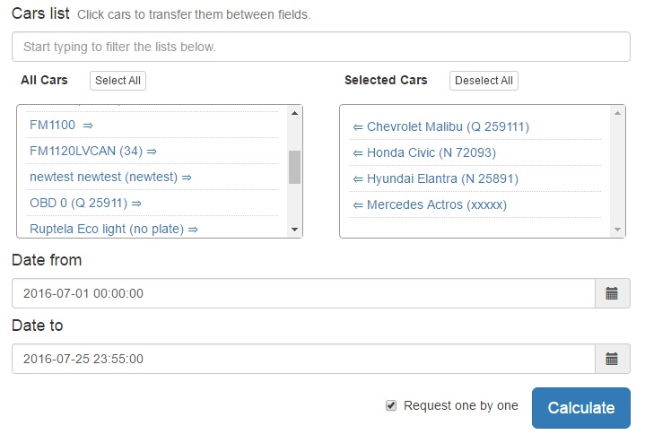
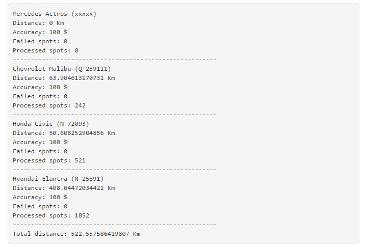

# Car distance calculator

## Description
App that allows you to select cars and calculate the distance they have driven in selected date range.

## Technologies
* PHP 5.5
* Laravel 5.2
* MongoDB 3.2.8
* AngularJS 1.5.8
* Bootstrap 3.3.6
* jQuery 2.2.4

## Laravel packages
* jenssegers/mongodb 3.0 ([link](https://github.com/jenssegers/laravel-mongodb))

## Usage
In order to calculate the distance you need to select a car or several cars you want then select the date range and click "Calculate".

## Demo example

## Performance suggestion
*In order to calculate the results faster, distance should be calculated and saved to database in
separate table everyday with a relation to car. In this case there wouldn't be necessary to loop through
all spots between the selected date range which can be millions of data. The way I'm offering we would
loop through individual car's archived everyday driven distance data which would be much less data to be
processed. There could be archived even monthly car distances and only the last day's spots would be
looped to have an exact distance on the real time with the data written on DB.

*About the data there's now: it would be perfect to have car imei number straightly on the car table not
in the array as it is now. Then a relation could be created and more of laravel eloquent methods could
be used.